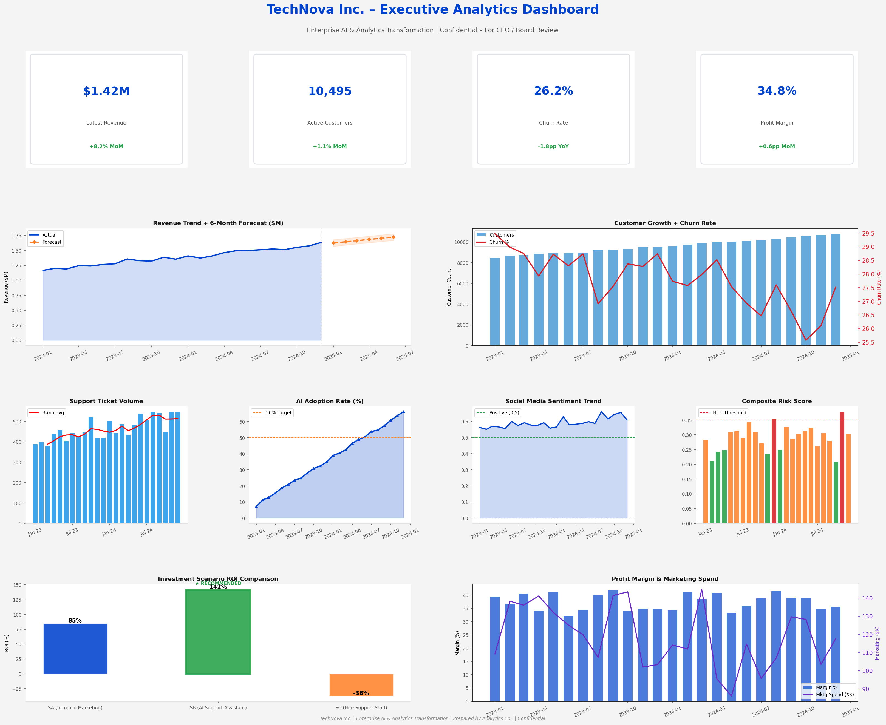
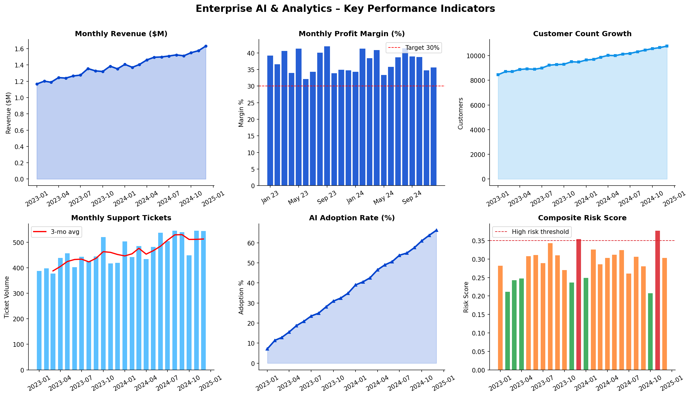
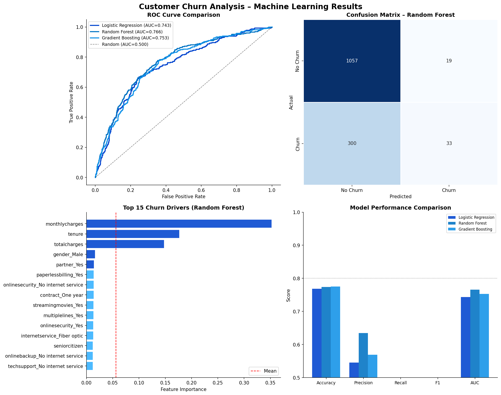
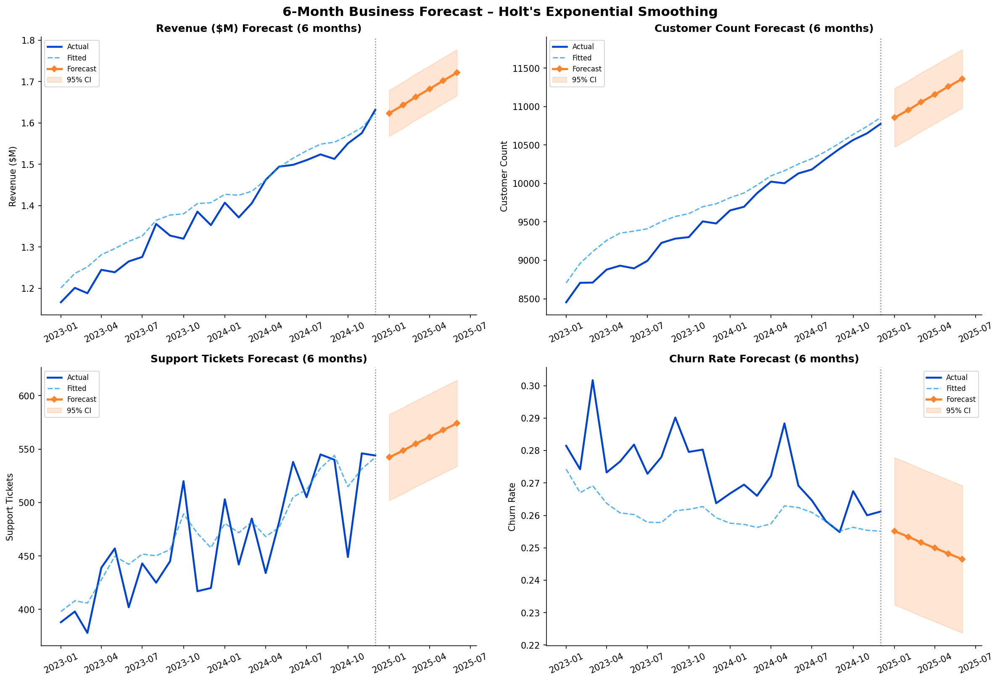
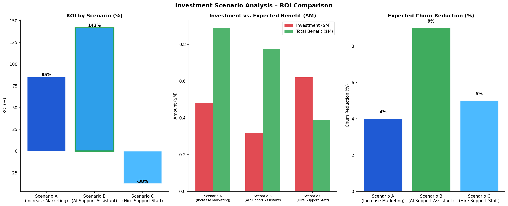

## Executive Dashboard

## KPI Dashboard

## Churn Analytics

## Forecasting

## Scenario Analysis

## Executive Summary

This project simulates an IBM-style AI & Analytics consulting engagement for a fictional enterprise software company. Analysis identified customer churn, support operations inefficiencies, and low AI adoption as key business risks. Scenario modeling showed that deploying an AI Customer Support Assistant generated the highest projected ROI (142%) while reducing churn and support backlog.

See the full Executive Summary in:
📄 [Executive Summary](EXECUTIVE_SUMMARY.md)
